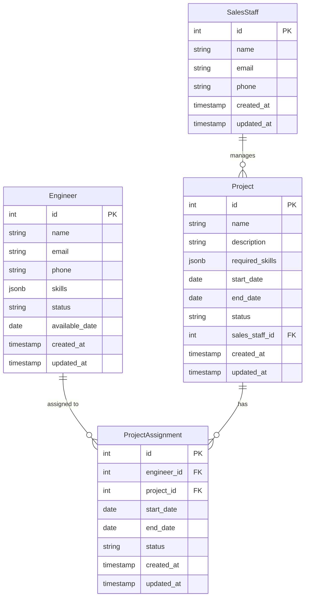

# データベース設計書

## ERD（Entity Relationship Diagram）



## テーブル定義

### 1. engineers（エンジニア）

| カラム名 | 型 | NULL | デフォルト | キー | 説明 |
|----------|-----|------|------------|------|------|
| id | INTEGER | NO | | PK | 主キー |
| name | VARCHAR(100) | NO | | | 名前 |
| email | VARCHAR(255) | NO | | UQ | メールアドレス |
| phone | VARCHAR(20) | YES | | | 電話番号 |
| skills | JSONB | NO | | | スキル情報 |
| status | VARCHAR(20) | NO | '稼働可能' | | 状態 |
| available_date | DATE | YES | | | 稼働可能日 |
| created_at | TIMESTAMP | NO | CURRENT_TIMESTAMP | | 作成日時 |
| updated_at | TIMESTAMP | NO | CURRENT_TIMESTAMP | | 更新日時 |

#### インデックス
- email（UNIQUE）
- skills（GIN）- JSONBの検索用
- status, available_date（複合）- 検索・絞り込み用

#### skills JSONBの構造
```json
{
  "languages": ["Python", "JavaScript", "Java"],
  "frameworks": ["FastAPI", "React", "Spring Boot"],
  "databases": ["PostgreSQL", "MongoDB"],
  "cloud": ["AWS", "GCP"],
  "other": ["Docker", "Kubernetes"]
}
```

### 2. projects（案件）

| カラム名 | 型 | NULL | デフォルト | キー | 説明 |
|----------|-----|------|------------|------|------|
| id | INTEGER | NO | | PK | 主キー |
| name | VARCHAR(200) | NO | | | 案件名 |
| description | TEXT | YES | | | 案件説明 |
| required_skills | JSONB | NO | | | 必要スキル |
| start_date | DATE | NO | | | 開始日 |
| end_date | DATE | NO | | | 終了日 |
| status | VARCHAR(20) | NO | '準備中' | | 状態 |
| sales_staff_id | INTEGER | NO | | FK | 営業担当者ID |
| created_at | TIMESTAMP | NO | CURRENT_TIMESTAMP | | 作成日時 |
| updated_at | TIMESTAMP | NO | CURRENT_TIMESTAMP | | 更新日時 |

#### インデックス
- required_skills（GIN）- JSONBの検索用
- status（B-tree）
- sales_staff_id（B-tree）
- start_date, end_date（複合）

#### required_skills JSONBの構造
```json
{
  "must": {
    "languages": ["Python", "JavaScript"],
    "frameworks": ["FastAPI", "React"],
    "databases": ["PostgreSQL"]
  },
  "preferred": {
    "languages": ["TypeScript"],
    "frameworks": ["Django"],
    "other": ["Docker"]
  }
}
```

### 3. sales_staff（営業担当者）

| カラム名 | 型 | NULL | デフォルト | キー | 説明 |
|----------|-----|------|------------|------|------|
| id | INTEGER | NO | | PK | 主キー |
| name | VARCHAR(100) | NO | | | 名前 |
| email | VARCHAR(255) | NO | | UQ | メールアドレス |
| phone | VARCHAR(20) | YES | | | 電話番号 |
| created_at | TIMESTAMP | NO | CURRENT_TIMESTAMP | | 作成日時 |
| updated_at | TIMESTAMP | NO | CURRENT_TIMESTAMP | | 更新日時 |

#### インデックス
- email（UNIQUE）

### 4. project_assignments（案件アサイン）

| カラム名 | 型 | NULL | デフォルト | キー | 説明 |
|----------|-----|------|------------|------|------|
| id | INTEGER | NO | | PK | 主キー |
| engineer_id | INTEGER | NO | | FK | エンジニアID |
| project_id | INTEGER | NO | | FK | 案件ID |
| start_date | DATE | NO | | | 開始日 |
| end_date | DATE | NO | | | 終了日 |
| status | VARCHAR(20) | NO | '予定' | | 状態 |
| created_at | TIMESTAMP | NO | CURRENT_TIMESTAMP | | 作成日時 |
| updated_at | TIMESTAMP | NO | CURRENT_TIMESTAMP | | 更新日時 |

#### インデックス
- engineer_id, project_id（複合UNIQUE）
- status（B-tree）
- start_date, end_date（複合）

## マイグレーション管理

### マイグレーションコマンド
```bash
# マイグレーション作成
alembic revision --autogenerate -m "説明"

# マイグレーション実行
alembic upgrade head

# マイグレーション履歴確認
alembic history
```

## バックアップとリストア

### バックアップ
```bash
# フルバックアップ
pg_dump -U postgres -d project_e > backup.sql

# データのみ
pg_dump -U postgres -d project_e --data-only > data.sql
```

### リストア
```bash
# フルリストア
psql -U postgres -d project_e < backup.sql

# データのみ
psql -U postgres -d project_e < data.sql
```