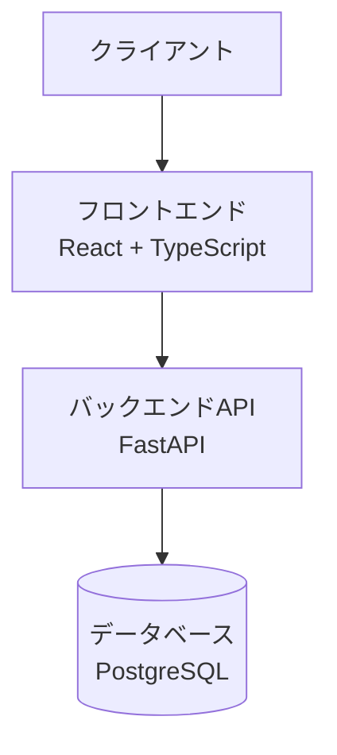
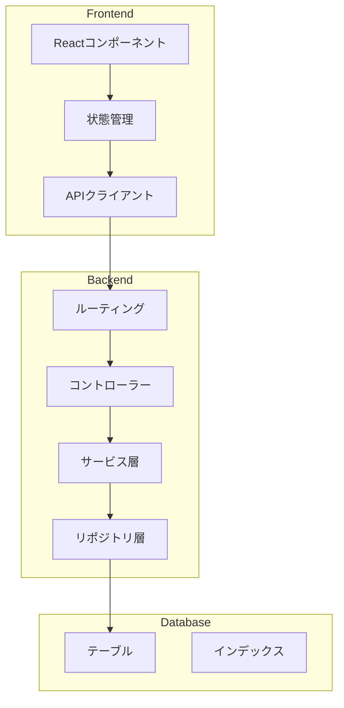

# システム構成書

## 1. システムアーキテクチャ

### 全体構成

### コンポーネント構成

## 2. 技術スタック詳細

### フロントエンド
- フレームワーク: React 18.x
- 言語: TypeScript 5.x
- ビルドツール: Vite
- スタイリング: Tailwind CSS
- 状態管理: Redux Toolkit
- HTTPクライアント: Axios
- フォーム: React Hook Form
- バリデーション: Zod

### バックエンド
- フレームワーク: FastAPI
- 言語: Python 3.11
- ORM: SQLAlchemy 2.0
- マイグレーション: Alembic
- バリデーション: Pydantic
- API文書化: OpenAPI (Swagger)

### データベース
- RDBMS: PostgreSQL 15
- 接続プール: pgBouncer
- バックアップ: pg_dump

### インフラストラクチャ
- コンテナ化: Docker
- オーケストレーション: Docker Compose
- CI/CD: GitHub Actions

## 3. セキュリティ設計

### 認証・認可
- JWT（JSON Web Token）による認証
- ロールベースのアクセス制御
- セッション管理

### データ保護
- データの暗号化（保存時）
- SSL/TLS通信
- パスワードハッシュ化（bcrypt）

### セキュリティ対策
- CORS設定
- XSS対策
- CSRF対策
- SQLインジェクション対策
- レート制限

## 4. 性能要件

### 目標値
- ページロード時間: 2秒以内
- API応答時間: 1秒以内
- 同時接続数: 100ユーザー
- データ処理量: 1万レコード/日

### スケーラビリティ対策
- 水平スケーリング対応
- キャッシュ戦略
- 非同期処理
- バッチ処理

## 5. 監視・運用設計

### 監視項目
- システムメトリクス
  - CPU使用率
  - メモリ使用率
  - ディスク使用率
  - ネットワークトラフィック

- アプリケーションメトリクス
  - リクエスト数
  - エラー率
  - レスポンスタイム
  - アクティブユーザー数

### ロギング設計
- アプリケーションログ
- アクセスログ
- エラーログ
- 監査ログ

## 6. バックアップ・リカバリ

### バックアップ方針
- フルバックアップ: 週1回
- 差分バックアップ: 毎日
- トランザクションログ: リアルタイム

### リカバリ手順
1. 最新のフルバックアップを復元
2. 差分バックアップの適用
3. トランザクションログの再生

## 7. 開発・デプロイメントフロー

### 開発フロー
1. 機能要件の定義
2. 設計・実装
3. ユニットテスト
4. 統合テスト
5. コードレビュー
6. マージ

### デプロイメントパイプライン
1. ソースコードのビルド
2. 自動テストの実行
3. 静的解析
4. Dockerイメージのビルド
5. テスト環境へのデプロイ
6. 受入テスト
7. 本番環境へのデプロイ